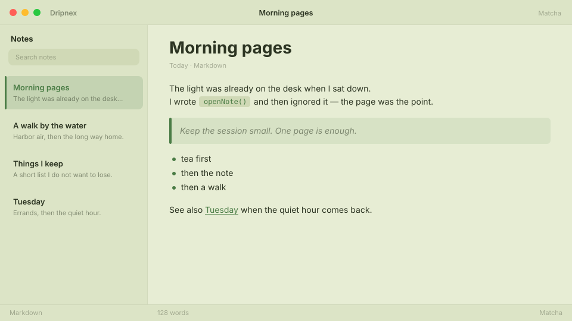

# Matcha

Green-tea paper. Calm reading, no rush.



```
dripnex/theme-matcha
```

## Palette

The chips live in [palette.html](palette.html) — open it in a browser. GitHub won’t paint HTML swatches here, so the hex list is below.

| Name | Token | Color | What it’s for |
| --- | --- | --- | --- |
| Base | `--bg-base` | `#e7edd4` | Window background |
| Surface | `--bg-surface` | `#dce4c6` | Sidebar and chrome |
| Elevated | `--bg-elevated` | `#f3f6e6` | Raised panels |
| Text | `--text-primary` | `#2c3422` | Headings and body |
| Muted | `--text-muted` | `#2c3422 · rgba(44, 52, 34, 0.52)` | Secondary copy |
| Accent | `--accent` | `#4a7c45` | Selection and links |
| Active | `--status-active` | `#4a7c45` | Active status |
| Dropped | `--status-dropped` | `#c44b4b` | Dropped status |

Pick it for slow reading on green-tea paper.
